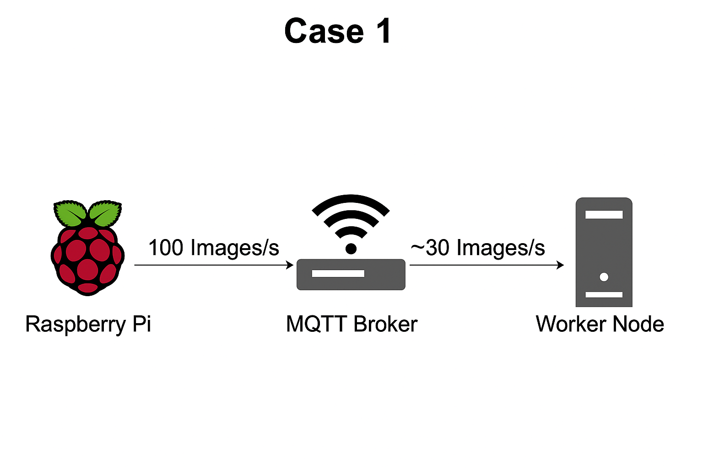

# Network Performance Evaluation Using MQTT Image Transmission

## Overview

This repository contains an experimental framework designed to evaluate the **performance limitations of MQTT-based image transmission** between multiple Raspberry Pi publisher nodes and worker-node subscribers in both **Wi-Fi** and **LAN** environments.

In this experiment, we investigated whether the **network medium** (5 GHz Wi-Fi vs. LAN) or the **MQTT broker** serves as the dominant bottleneck when transmitting high-throughput image streams. The system captures images on Raspberry Pi devices, encodes them as JPEG, Base64-encodes the data, and publishes the result via MQTT. Worker nodes subscribe to the MQTT topics and decode and store the received images.

Each Raspberry Pi captured **480p JPEG frames (~80 KB)**, which grew to approximately **100 KB** after Base64 encoding. Images were transmitted at high frequency, with throughput controlled by modifying MQTT publish settings. Reception rates were monitored to determine bottleneck locations.

---

# Repository Contents

### **MQTT/Image_Capture.py** (Publisher / Sender)

This script runs on a Raspberry Pi and performs:

* Capturing 480p frames via OpenCV.
* JPEG compression and Base64 encoding.
* Publishing encoded images to MQTT topics.
* Adjustable controls for load testing:

  * `MULTIPLY_FACTOR`: number of times the same image is published per loop.
  * `sleep.time()`: inter-frame delay, set to **0.001 seconds** to maximize throughput.
* Uses persistent counters to generate stable filenames.

This is the **only script modified for each experiment**.

### **MQTT/images_Receiver.py** (Subscriber / Worker Node)

This script runs on any worker node receiving images.

* Subscribes to `images/#` topics.
* Decodes Base64 JPEG payloads back into images.
* Saves each received image with timestamp-based filenames.
* Uses a queue + worker thread to avoid blocking MQTT callbacks.

This script remains **unchanged for all experiments**. Only the MQTT broker IP is adjusted per case.

### **MQTT/requirements.txt**

Contains Python dependencies:

* `paho-mqtt`
* `opencv-python`
* `numpy`

---

# System Setup Instructions (Sender & Receiver)

Follow these steps on **every Raspberry Pi** and **every worker node**.

---

## 1. Update System Packages

```bash
sudo apt update -y
sudo apt upgrade -y
```

---

## 2. Install Python 3.10+ and Pip

Most Raspberry Pis already include Python, but ensure it exists:

```bash
python3 --version
```

If missing:

```bash
sudo apt install python3 python3-pip -y
```

Upgrade pip:

```bash
python3 -m pip install --upgrade pip
```

---

## 3. Install Virtual Environment Tools

```bash
sudo apt install python3-venv -y
```

---

## 4. Create and Activate a Virtual Environment

```bash
python3 -m venv mqtt-env
source mqtt-env/bin/activate
```

You should now see:

```
(mqtt-env) user@raspberrypi:~$
```

---

## 5. Install Required Python Libraries

Copy the repository folder to the device, then run:

```bash
pip install -r requirements.txt
```

This installs OpenCV, Paho MQTT, and NumPy.

---

# Experimental Methodology

Our experiments were structured to progressively isolate network and broker limitations by altering the number of publishers, brokers, and communication mediums.

To maximize stress on the MQTT pipeline:

* Camera delay was minimized to:

  ```python
  time.sleep(0.001)
  ```
* Image duplication rate was modified using:

  ```python
  MULTIPLY_FACTOR = X
  ```

We found:

* At **MULTIPLY_FACTOR = 8**, the MQTT pipeline delivered maximum stable throughput.
* Increasing beyond 8 caused rapid saturation, indicating either **Wi-Fi network limitations** or **MQTT broker CPU constraints**.

---

# Experimental Scenarios

## **Case 1: Single Pi → Single MQTT Broker → Single Receiver (5 GHz Wi-Fi)**

* One RPi runs **image capture + MQTT broker**.
* Receiver connects over the same 5 GHz Wi-Fi.
* Receiver script:
  Set broker IP to the **sender Pi's IP**.

Purpose: Measure baseline performance and identify single-pipeline limits.




---

## **Case 2: Three Pis → One MQTT Broker → One Receiver (5 GHz Wi-Fi)**

* Three publisher RPis.
* One separate Raspberry Pi running the MQTT broker.
* Publisher and receiver both connect to the same broker.
* Scripts must use the **IP of the dedicated broker Pi**.

Purpose: Observe scaling behavior when multiple publishers compete for a single broker.

---

## **Case 3: Three Pis → Three MQTT Brokers → Three Worker Nodes (5 GHz Wi-Fi)**

* Each publisher has its **own dedicated broker**.
* Each worker node subscribes only to its corresponding publisher.
* All nodes connect to the same Wi-Fi (5 GHz).
* Broker IP in sender/receiver must match its pair.

Purpose: Measure parallelism and evaluate whether broker isolation removes bottlenecks.

---

## **Case 4: Single Pi → Single Broker → Single Receiver (LAN)**

* Similar to Case 1 but using **LAN via router/switch**.
* All devices connected via Ethernet cables.
* Broker IP = sender Pi's IP.

Purpose: Compare LAN vs. Wi-Fi single-pipeline throughput.

---

## **Case 5: Three Pis → One Broker → One Receiver (LAN)**

* Three publishers on LAN.
* One broker on a dedicated Pi.
* Receiver also on LAN.
* Scripts updated with broker IP.

Purpose: Evaluate LAN improvements in multi-publisher saturation.

---

## **Case 6: Three Pis → Three Brokers → Three Worker Nodes (LAN)**

* LAN-connected network.
* Each publisher communicates with its dedicated broker.
* Each subscriber listens to only its broker.

Purpose: Determine maximum achievable throughput when both network and broker bottlenecks are removed.

---

# Modifying the Image_Capture Script for Experiments

Only two key modifications are required:

### **1. Change the Broker IP**

```python
BROKER = "192.168.X.X"
```

Set depending on experiment case.

---

### **2. Adjust MULTIPLY_FACTOR**

This controls how many duplicates of each captured image are published:

```python
MULTIPLY_FACTOR = 8
```

* Use **8** to reach maximum throughput.
* Increase to test upper limits (expect broker or network failure beyond ~10–12).

---

# Running the System

## **Start Receiver First**

On each worker node:

```bash
python3 images_Receiver.py
```

## **Start Publisher(s)**

On each Raspberry Pi:

```bash
python3 Image_Capture.py
```

Each publisher begins streaming images immediately.

---

# Conclusion

This repository provides a complete framework for **measuring MQTT-based image delivery performance** in controlled multi-device setups. Through structured tests across Wi-Fi and LAN, and varying publishers/brokers, it becomes possible to empirically identify bottlenecks and quantify the impact of network conditions and broker load on message throughput.

This structured README allows any user to replicate the experiments and understand the behavior of MQTT-based image streaming systems.
