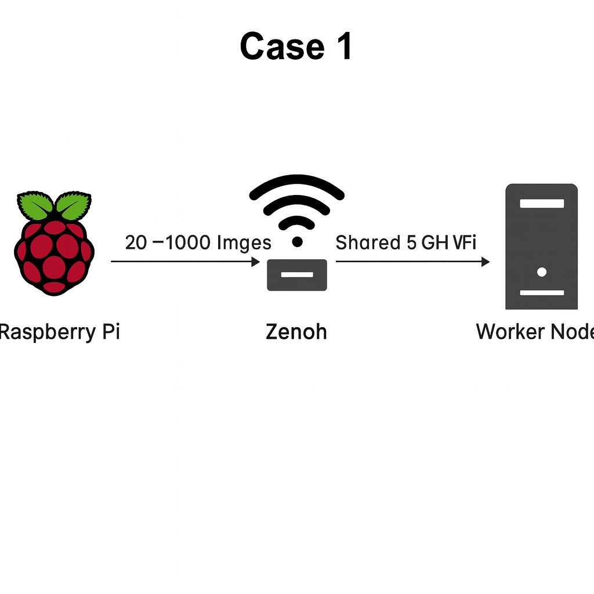

# Zenoh-Based Multi-Raspberry Pi Image Streaming

### Performance Benchmarking Over Wi-Fi vs LAN

---

## 1. Overview

This project investigates the performance limitations of a **Zenoh-based high-throughput image transmission pipeline** using multiple Raspberry Pis (**publishers**) sending images to one or more worker nodes (**subscribers**) in a local network.

The goal of the experiment is to determine **what becomes the bottleneck** when streaming large volumes of images:

* **The network medium**?
  (5 GHz Wi-Fi vs Ethernet LAN)

* **The Zenoh middleware stack**?
  (single broker vs multiple brokers, shared vs independent pipelines)

Each Raspberry Pi captures **480p JPEG images** of size ~**60–70 KB**.
These are sent via Zenoh at high rates (20–5000 images/s), and worker nodes measure the **actual number of images received per second** in different scenarios.

---

## 2. Repository Structure

| File                  | Description                                                                                                 |
| --------------------- | ----------------------------------------------------------------------------------------------------------- |
| `zenoh_pub_camera.py` | Publisher script for Raspberry Pi — captures camera images, JPEG-encodes them, and publishes them via Zenoh |
| `zenoh_sub_images.py` | Subscriber script for worker node — receives JPEG bytes and stores them as files                            |
| `requirements.txt`    | Python dependencies for both scripts                                                                        |
| `README.md`           | Experiment explanation + setup guide + replication steps                                                    |

---

## 3. Script Descriptions

### 3.1 `zenoh_pub_camera.py` — Publisher (Raspberry Pi)

This script performs the following:

* Opens the Raspberry Pi camera using OpenCV.

* Captures frames at **480p resolution**.

* Converts each frame to JPEG (`.jpg`).

* Publishes the JPEG bytes to a Zenoh key such as:

  ```
  office/pi1/image
  ```

* Connects to a worker node via Zenoh using:

  ```python
  WORKER_IP = "192.168.X.Y"
  ```

* Publishes each captured image **MULTIPLY_FACTOR** times to intentionally increase the load:

  ```python
  MULTIPLY_FACTOR = 1–1000
  ```

* Uses a **minimal delay** in the main loop:

  ```python
  time.sleep(0.001)
  ```

  to generate **maximum possible traffic**.

You modify only:

* `WORKER_IP`
* `KEY_BASE`
* `MULTIPLY_FACTOR`

Everything else normally stays unchanged.

---

### 3.2 `zenoh_sub_images.py` — Subscriber (Worker Node)

This script:

* Declares itself as a Zenoh **subscriber**.

* Listens for a specific image key, i.e:

  ```python
  KEY_EXPR = "office/pi1/image"  # It can be any.
  ```

* For each received payload:

  * Converts the bytes to a JPEG file.
  * Saves it to `received_images/`.

* Prints the number of images received per second.

For all experiments,  **keep this script unchanged**, except making sure its `KEY_EXPR` matches the publisher’s `KEY_BASE`.

---

## 4. System Preparation (All Machines)

Must configure **every Raspberry Pi** (publishers) and **every worker node** (subscribers).

### 4.1 Update System

```bash
sudo apt update
sudo apt upgrade -y
```

### 4.2 Install Python 3 and pip

```bash
sudo apt install -y python3 python3-pip python3-venv
```

### 4.3 Create Virtual Environment

Go to your project directory:

```bash
cd /path/to/project
```

Create & activate venv:

```bash
python3 -m venv venv
source venv/bin/activate
```

Upgrade pip:

```bash
pip install --upgrade pip
```

### 4.4 Install Dependencies

```bash
pip install -r requirements.txt
```

Repeat steps on **every Pi and every worker node**.

---

## 5. Running the System

### 5.1 Start Subscriber on Worker Node

```bash
cd /project
source venv/bin/activate
python3 zenoh_sub_images.py
```

Keep this terminal running.

### 5.2 Start Publisher on Raspberry Pi

On each Pi:

1. Open the script:

   ```bash
   nano zenoh_pub_camera.py
   ```

2. Set the worker IP, i.e.:

   ```python
   WORKER_IP = "192.168.1.#"
   ```

3. Set Zenoh key for this Pi, I.e:

   ```python
   KEY_BASE = "office/pi1/image"
   ```

4. Adjust multiply factor:

   ```python
   MULTIPLY_FACTOR = #
   ```

5. Run the publisher:

   ```bash
   python3 zenoh_pub_camera.py
   ```

---

# 6. Step-by-Step Guide for All Experimental Cases

### (Anyone can follow these steps—even without prior experience)

Each case below includes:

* Network setup
* Script modifications
* How to run sender(s)
* How to run receiver(s)
* What to observe

---

# **Case 1 — 1 Pi → 1 Worker, Single Zenoh, Wi-Fi**

### **Goal:**

Test the maximum throughput of a single publisher–subscriber pair over Wi-Fi.

### **Steps:**

1. Connect both Pi and worker node to **5 GHz Wi-Fi**.

2. On worker:

   * Ensure `KEY_EXPR = "office/pi1/image"`
   * Run the subscriber:

     ```bash
     python3 zenoh_sub_images.py
     ```

3. On the Pi:

   * Set:

     ```python
     WORKER_IP = "<worker_ip>"
     KEY_BASE = "office/pi1/image"
     MULTIPLY_FACTOR = 1–20
     ```

   * Run:

     ```bash
     python3 zenoh_pub_camera.py
     ```


---

# **Case 2 — 2 Pis → 1 Worker, Same Zenoh, Wi-Fi**

### **Goal:**

See if adding more Pis increases throughput on Wi-Fi.

### **Steps:**

1. Connect all Pis + worker to same Wi-Fi.

2. On worker (only one):

   ```bash
   python3 zenoh_sub_images.py
   ```

3. On **Pi1**:

   ```python
   KEY_BASE = "office/pi1/image"
   WORKER_IP = "<worker_ip>
   ```

4. On **Pi2**:

   ```python
   KEY_BASE = "office/pi1/image"
   WORKER_IP = "<worker_ip>
   ```

   (Both Pis publish to same key → same worker)

5. Start both publishers.


---

# **Case 3 — 3 Pis → 1 Worker, Same Zenoh, Wi-Fi**

### Steps:

Same as Case 2 but with 3 Pis.


---

# **Case 4 — 2 Pis → 2 Workers, Each Own Zenoh, Wi-Fi**

### **Goal:**

Check if using separate Zenoh sessions avoids bottleneck.

### Steps:

1. Pi1 → Worker1 (`office/pi1/image`)
2. Pi2 → Worker2 (`office/pi2/image`)


Each publisher uses its own IP + key.

### Commands:

On Worker1:

```bash
python3 zenoh_sub_images.py
```

Worker2:

```python
KEY_EXPR="office/pi2/image"
```

Start 2 publishers separately.


---


# **Case 5 — 3 Pis → 3 Workers, Each Own Zenoh, Wi-Fi**

### **Goal:**

Check if using separate Zenoh sessions avoids bottleneck.

### Steps:

1. Pi1 → Worker1 (`office/pi1/image`)
2. Pi2 → Worker2 (`office/pi2/image`)
3. Pi3 → Worker3 (`office/pi3/image`)

Each publisher uses its own IP + key.

### Commands:

On Worker1:

```bash
python3 zenoh_sub_images.py
```

Worker2:

```python
KEY_EXPR="office/pi2/image"
```

Worker3:

```python
KEY_EXPR="office/pi3/image"
```

Start 3 publishers separately.


---

# **Case 6 — 1 Pi → 1 Worker on Ethernet LAN**

### Steps:

1. Connect Pi + worker to **LAN switch (Ethernet)**.
2. Run subscriber on worker.
3. Run publisher on Pi.


---

# **Case 7 — 2 Pis → 1 Worker, Same Zenoh, LAN**

### Steps:

Both Pis publish to same key → same worker.


---

# **Case 8 — 3 Pis → 1 Worker, Same Zenoh, LAN**

Three Pis publish to same key → same worker.

1. All the Pis will have same Key matches to the key of the subscriber node/worker.
2. All the Pis will have IP of the worker. 


---

# **Case 9 — 2 Pis → 2 Workers, Independent Zenoh, LAN**

### Steps:

* Pi1 ↔ Worker1
* Pi2 ↔ Worker2

Separate IPs, separate keys.


---

# **Case 10 — 3 Pis → 3 Workers, Independent Zenoh, LAN**

### Steps:

* Pi1 ↔ Worker1
* Pi2 ↔ Worker2
* Pi3 ↔ Worker3

Separate IPs, separate keys.

→ Zenoh scales horizontally when using multiple broker/worker pipelines.

---

# 7. Final Notes for Reproducibility

* Always ensure **publisher’s KEY_BASE matches subscriber’s KEY_EXPR**.
* `WORKER_IP` must be reachable.
* Use `MULTIPLY_FACTOR` to increase stress on Zenoh/network.
* Keep:

  ```
  time.sleep(0.001)
  ```

  to maximize camera output rate.


---


